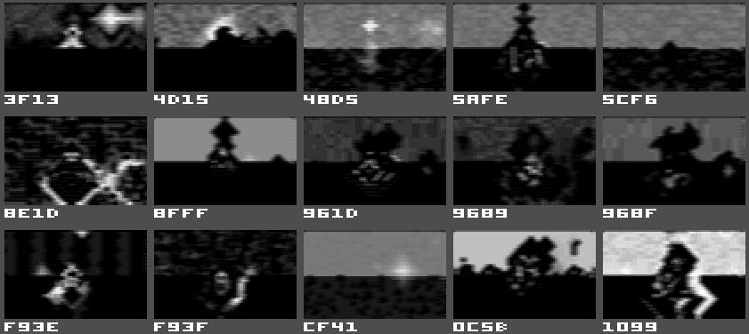

# False Dimension (2012)

A 2K'ish demo for the Commodore 64.

The main technical point in this one is using a pseudorandom generator with
16-bit seeds to generate Rorschach-type imagery, especially landscapes. A
fixed series of hand-picked seeds is used to run the demo.

The same generator is used in Metadimension (2019).

https://www.pouet.net/prod.php?which=59125

